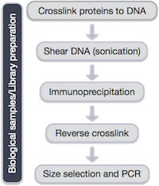

During this session we will be performing a complete workflow for ChIP-seq analysis, starting with experimental design and generation of the raw sequencing reads and ending with functional enrichment analyses and motif discovery.

## Experimental design and library preparation

Several steps are involved in the library preparation of protein-bound DNA fragments for sequencing: 

1. After the chromatin is isolated from the cell, proteins are cross-linked to the DNA
2. The DNA is sheared into fragments (sonication)
3. A protein-specific antibody is used to immunoprecipitate the protein-bound DNA fragments
4. The crosslink is reversed and DNA purified
5. DNA fragments are size selected and amplified using PCR

Within the DNA fragments enriched for the regions binding to a protein of interest, only a fraction correspond to actual signal. The proportion of DNA fragments containing the actual binding site of the protein depends on the **number of active binding sites, the number of starting genomes, and the efficiency of the IP**. 

In addition, when performing ChIP-seq, some sequences may appear enriched due to the following:

- Open chromatin regions are fragmented more easily than closed regions
- Repetitive sequences might seem to be enriched (copy number inaccuracies in genome assembly)
- Uneven distribution of sequence reads across the genome

Therefore, proper controls are essential. A ChIP-seq peak should be compared with the same region of the genome in a matched control.

The same starting material should be divided to be used for both the protein-specific IP and the control. The control sample can be generated by one of the following recommended techniques: 

- No IP (input DNA) 
- No antibody ("mock IP")
- Non-specific antibody (IgG "mock IP")

***
*This lesson has been developed by members of the teaching team at the [Harvard Chan Bioinformatics Core (HBC)](http://bioinformatics.sph.harvard.edu/). These are open access materials distributed under the terms of the [Creative Commons Attribution license](https://creativecommons.org/licenses/by/4.0/) (CC BY 4.0), which permits unrestricted use, distribution, and reproduction in any medium, provided the original author and source are credited.*
