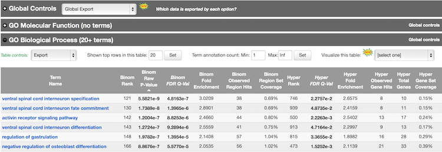
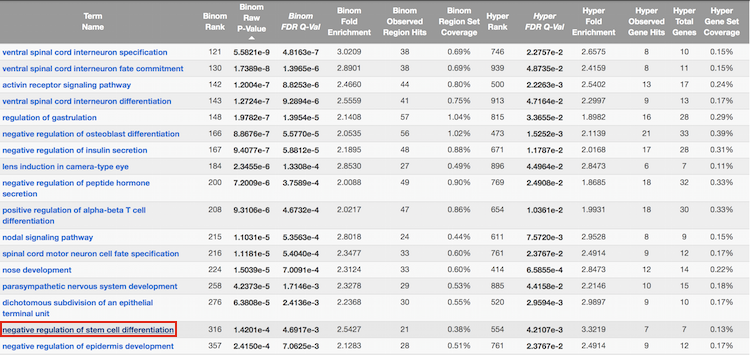

Approximate time: 40 minutes

## Learning Objectives

* Explore web-based tools for functional enrichment analysis of the peak calls

## Web-based Functional Enrichment: GREAT


We have identified regions of enrichment in the genome which represent the potential binding sites for Nanog and Pou5f1. 

After identifying likely binding sites, downstream analyses will often include: 

1. Identifying which genes are associated with the binding sites 
2. Exploring whether there is any associated enrichment of processes, pathways, or networks

We will explore a web-based tool called [GREAT](http://great.stanford.edu/public/html/) for performing these analyses using our Nanog peak calls.

Since the functional enrichment analyses are unlikely to give reliable results using only the 32.8 Mb of reads mapping to chr12,  we will use the **full set of peak calls output from the IDR analysis**.

## Set-up

Start an interactive session:

```bash
$ srun --pty -p interactive -t 0-12:00 --mem 1G --reservation=HBC2 bash	
```

Extract the first three columns of the IDR peak calls for the whole genome of Nanog:

```bash
$ cd ~/chipseq/results

$ mkdir functional_analysis

$ cd functional_analysis

$ cp /n/groups/hbctraining/chip-seq/full-dataset/idr/*.bed .

$ cut -f 1,2,3 Nanog-idr-merged.bed  > Nanog-idr-merged-great.bed
```


Using `scp` or **FileZilla** on your local computer, transfer `Nanog-idr-merged-great.bed` to your Desktop.

```bash
$ scp username@transfer.rc.hms.harvard.edu:~/chipseq/results/functional_analysis/*merged-* Desktop/
```

## Functional enrichment analysis

We will use [GREAT](http://bejerano.stanford.edu/great/public/html/index.php) to perform the functional enrichment analysis. GREAT takes a list of regions, associates them with nearby genes, and then analyzes the gene annotations to assign biological meaning to the data.

 Open [GREAT](http://bejerano.stanford.edu/great/public/html/index.php), and perform the following steps:

1. Choose the `Nanog-idr-merged-great.bed` file and use the `Whole genome` for Background regions. Click Submit. GREAT provides the output in HTML format organized by section.

2. Expand the `Job Description` section. Click on `View all genomic region-gene associations`. Note that each associated gene is listed with location from the transcription start site as shown below:

	

	Within this section, you have the option to download the list of genes associated with Nanog binding sites or you could view all of the binding sites as a custom track in the UCSC Genome Browser.
	
3. Scroll down to the `Region-Gene Association Graphs`. Observe the graphics displaying the summary of the number of genes associated with each binding site and the binding site locations relative to the transcription start sites of the associated genes
	
	

4. Below the `Region-Gene Association Graphs` are the `Global Controls`, where you can select the annotation information to display. Keep the default settings and scroll down to view the information displayed. 

5. Explore the GO Biological Process terms associated with the Nanog binding sites. Notice the options available at the top of the tables for exporting data, changing settings, and visualization.

	
	
	GREAT calculates two measures of statistical enrichment: "one using a binomial test over genomic regions and one using a hypergeometric test over genes" [[2](http://bejerano.stanford.edu/help/display/GREAT/Statistics)]. Each test has its own biases, which are compensated for by the other test. 
	
6. Click on the term `negative regulation of stem cell differentiation`:

	
	
	Note that summary information about the binding sites of Nanog for genes associated with this GO term are displayed.
	
7. Expand the section for `This term's genomic region-gene association tables`. Notice that you have the option to download the gene table.

8. Click on `NOTCH1`. Explore the binding regions directly within the UCSC Genome Browser.


***
*This lesson has been developed by members of the teaching team at the [Harvard Chan Bioinformatics Core (HBC)](http://bioinformatics.sph.harvard.edu/). These are open access materials distributed under the terms of the [Creative Commons Attribution license](https://creativecommons.org/licenses/by/4.0/) (CC BY 4.0), which permits unrestricted use, distribution, and reproduction in any medium, provided the original author and source are credited.*

